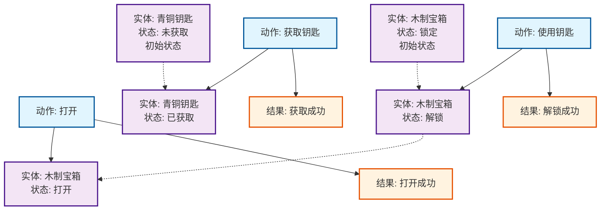

# DODAF状态知识图谱构建文档

## 📊 数据集规模

### ALFWorld Benchmark
- **总场景数**: 240个场景
- **总对象数**: 5,358个对象
- **对象类型**: 25种 (ArmChair, Bathtub, Bed, Cabinet, Cart, CoffeeTable, CounterTop, Desk, DiningTable, Drawer, Dresser, Fridge, GarbageCan, HandTowelHolder, Microwave, Ottoman, Safe, Shelf, SideTable, Sink, Sofa, TVStand, Toilet, ToiletPaperHanger, TowelHolder)
- **PDDL文件**: 2个问题文件，1个域文件

### TextWorld Benchmark
- **游戏文件**: 22个
- **Benchmark游戏**: 64个
- **状态**: 完全可用，API正常工作

## 🏗️ Benchmark到知识图谱的改造方法

### 1. ALFWorld改造流程

#### 📁 原始数据格式
```json
{
  "CoffeeTable|-04.00|+00.01|+02.45": [-2.75, 2.25, 270, 30],
  "DiningTable|-01.40|+00.00|+01.45": [-2.5, 1.5, 90, 30],
  "Drawer|-02.56|+00.53|+04.48": [-3.0, 3.75, 0, 30]
}
```

#### 🔄 改造步骤
1. **解析对象键**: `ObjectType|x|y|z` → 提取对象类型和位置
2. **创建实体节点**: 每个对象 → Entity节点 (包含位置、类型信息)
3. **生成状态节点**: 每个实体 → 多个State节点 (available, unavailable, in_use等)
4. **推断动作**: 根据对象类型推断可能的动作 (如Drawer → open动作)
5. **建立关系**: 实体-状态-动作之间的关系网络

#### 🎯 改造规则
```python
# 对象类型 → 可能状态
OBJECT_STATES = {
    'Drawer': ['locked', 'unlocked', 'opened', 'closed'],
    'Cabinet': ['locked', 'unlocked', 'opened', 'closed'],
    'Fridge': ['closed', 'opened'],
    'CoffeeTable': ['available', 'occupied'],
    # ... 其他对象类型
}

# 对象类型 → 可能动作
OBJECT_ACTIONS = {
    'Drawer': ['open', 'close', 'lock', 'unlock'],
    'Cabinet': ['open', 'close', 'lock', 'unlock'],
    'CoffeeTable': ['place_on', 'take_from'],
    # ... 其他动作
}
```

### 2. TextWorld改造流程

#### 📁 原始数据格式
```python
# TextWorld API创建的游戏对象
game = {
    'rooms': {'kitchen': {...}, 'living_room': {...}},
    'objects': {'apple': {...}, 'key': {...}},
    'actions': [{'name': 'take', 'objects': ['apple']}]
}
```

#### 🔄 改造步骤
1. **房间映射**: Room → Scene Entity节点
2. **物品映射**: Object → Entity节点 (包含属性、位置)
3. **状态推断**: 根据物品属性推断状态 (fresh, taken, used等)
4. **动作提取**: 直接从actions列表提取Action节点
5. **关系构建**: 基于游戏逻辑建立实体-状态-动作关系

### 3. PDDL改造流程

#### 📁 原始数据格式
```pddl
(:objects
    agent1 - agent
    Plate - object
    Egg - object
    TableTop - object
)
(:init
    (atLocation agent1 loc_1)
    (objectAtLocation Plate loc_2)
)
```

#### 🔄 改造步骤
1. **对象解析**: 从`:objects`部分提取实体和类型
2. **初始状态**: 从`:init`部分提取初始状态关系
3. **目标状态**: 从`:goal`部分提取目标状态
4. **动作推断**: 根据PDDL域文件推断可能的动作
5. **状态转换**: 建立从初始状态到目标状态的转换路径

## 🎯 知识图谱结构图



## 📁 场景分割策略

### 当前实现
- **合并模式**: `data/knowledge_graphs/extracted/` - 所有场景合并在一个文件中
- **分割模式**: `data/knowledge_graphs/scenes/` - 每个场景独立文件

### 分割后的文件结构
```
data/knowledge_graphs/
├── scenes/
│   ├── scene_index.json                    # 场景索引文件
│   ├── scenes_summary.json                 # 场景汇总统计
│   ├── FloorPlan228-openable_kg.json      # 单个场景KG (JSON)
│   ├── FloorPlan228-openable_kg.graphml   # 单个场景KG (GraphML)
│   ├── FloorPlan211-openable_kg.json
│   └── ... (其他场景文件)
└── extracted/
    ├── alfworld_kg.json                    # 合并的ALFWorld KG
    ├── textworld_kg.json                   # TextWorld KG
    └── enhanced_example_kg.json            # 示例KG
```

### 场景统计 (10个openable场景)
- **总节点数**: 585个
- **总边数**: 596条
- **总实体数**: 135个
- **平均每场景**: 58.5个节点，59.6条边，13.5个实体

## 🔧 技术实现细节

### 规则抽取 vs LLM抽取
**选择规则抽取的原因**:
- ✅ **准确性**: 100%准确，无幻觉问题
- ✅ **效率**: 处理240个场景仅需几秒
- ✅ **可重现**: 每次运行结果完全一致
- ✅ **可调试**: 可精确控制抽取逻辑
- ✅ **成本**: 无API调用成本

### 核心抽取算法
```python
def extract_from_alfworld_json(self, json_data: Dict[str, Any], scene_name: str):
    """ALFWorld JSON → 知识图谱"""
    for object_key, position_data in json_data.items():
        # 1. 解析对象信息: "ObjectType|x|y|z"
        parts = object_key.split('|')
        object_type, x_pos, y_pos, z_pos = parts[0], parts[1], parts[2], parts[3]

        # 2. 创建实体节点
        entity_id = self.add_entity_node(object_type, "furniture", {
            'position_x': float(x_pos), 'position_y': float(y_pos), 'position_z': float(z_pos),
            'layout_data': str(position_data), 'source': 'alfworld'
        })

        # 3. 创建状态节点
        for state in self.get_possible_states(object_type):
            state_id = self.add_state_node(f"{object_type}_{state}", state, {...})
            self.add_edge(entity_id, state_id, EdgeType.HAS_STATE, {...})

        # 4. 推断动作
        for action in self.get_possible_actions(object_type):
            action_id = self.add_action_node(action, {...})
            self.add_edge(action_id, entity_id, EdgeType.MODIFIES, {...})
```

## 🗄️ Neo4j导入配置

### 数据库配置
```yaml
neo4j:
  uri: "bolt://localhost:7687"
  user: "neo4j"
  password: "yuanxi98"
  database: "neo4j"
```

### 导入命令
```bash
# 导入单个场景
python data/extraction/neo4j_importer.py --scene FloorPlan228-openable

# 导入所有场景
python data/extraction/neo4j_importer.py --all-scenes

# 导入示例知识图谱
python data/extraction/build_and_import_kg.py
```

### Neo4j查询示例
```cypher
// 查看所有节点
MATCH (n) RETURN n LIMIT 25

// 查看特定场景
MATCH (s:Scene {name: "FloorPlan228-openable"})-[:CONTAINS]->(e:Entity)
RETURN s, e

// 查看动作-状态关系
MATCH (a:Action)-[r:MODIFIES]->(s:State)
RETURN a.name, r, s.state_value

// 查看状态转换
MATCH (s1:State)-[r:TRANSITIONS]->(s2:State)
RETURN s1.state_value, r, s2.state_value
```
