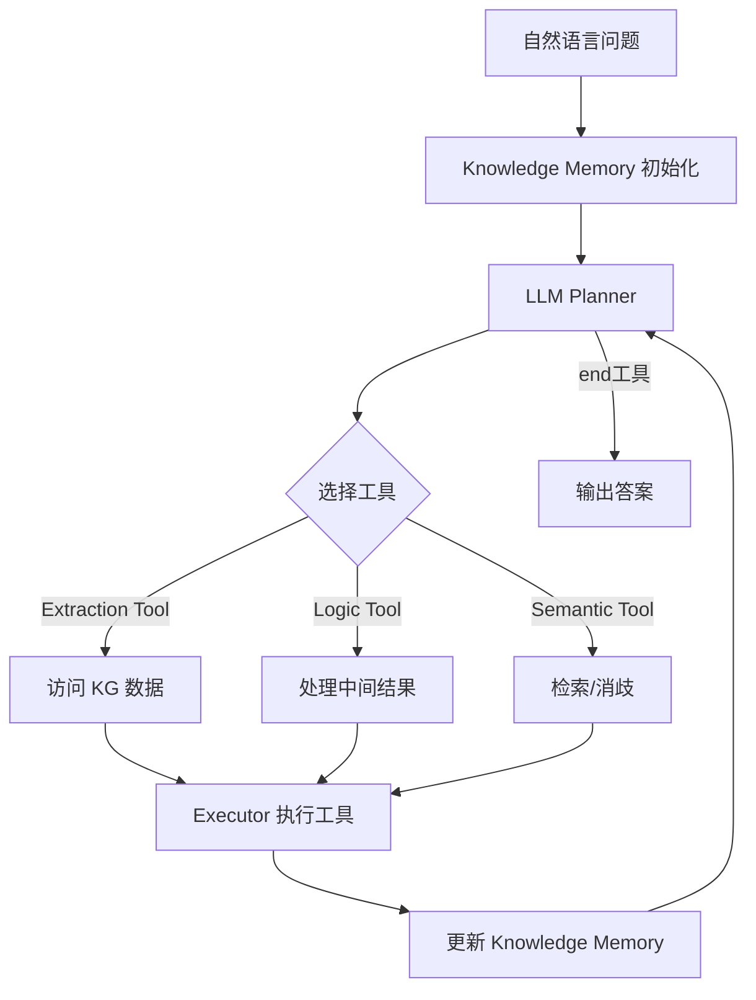
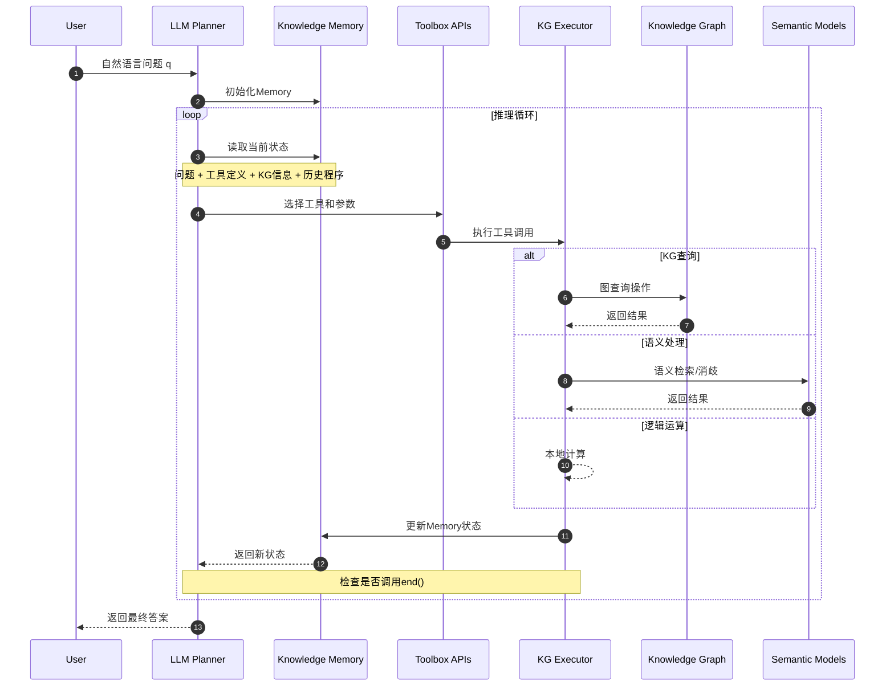
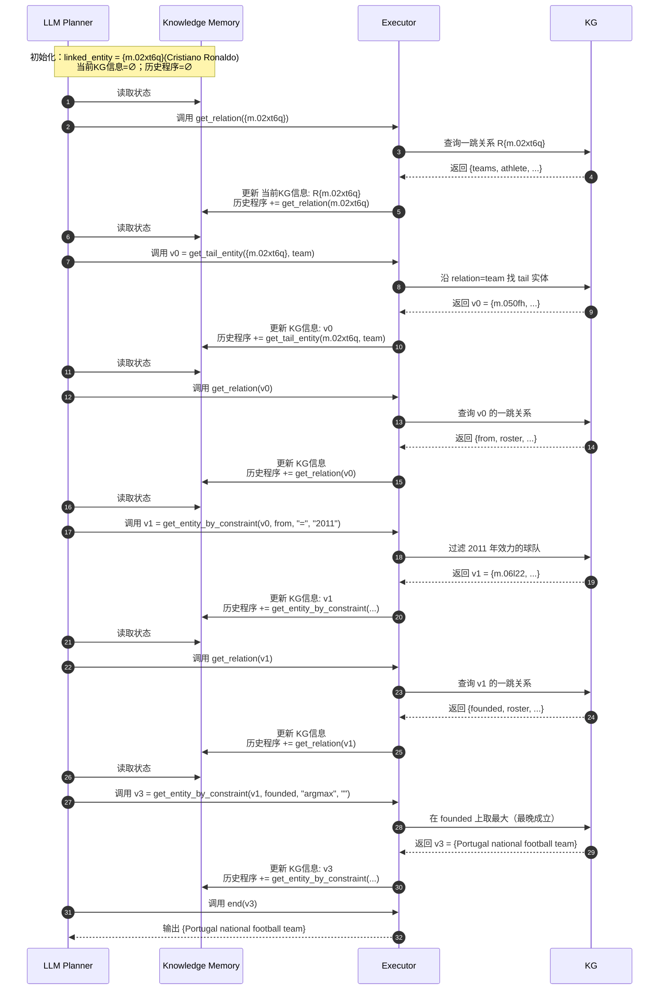
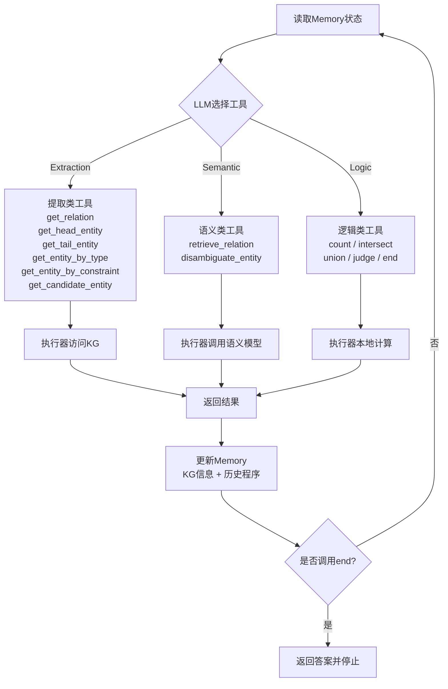
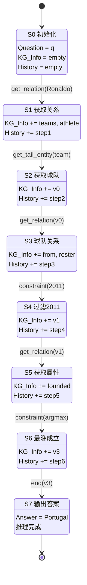
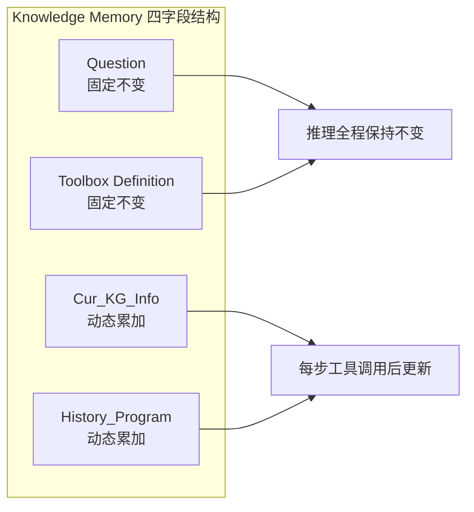

# KG-Agent: 少样本LLM基线方法研究

## 📖 论文概述

**论文标题**: KG-Agent: 基于知识图谱的自主推理智能体

**核心贡献**: 让一个中等大小的LLM（LLaMA2-7B）在知识图谱上做自主推理，通过工具箱设计、指令调优数据生成和自主推理机制，实现可解释、可控的知识图谱问答。

---

## 🔧 技术框架与创新点

KG-Agent的核心是让LLM在知识图谱上做自主推理，通过以下四部分协同工作：

### 核心组件

1. **LLM (Planner)**: 负责决策，选择下一步调用哪个工具
2. **Toolbox (工具箱)**: 提供操作KG的接口（提取、逻辑、语义工具）
3. **Executor (执行器)**: 执行工具调用，返回结果
4. **Knowledge Memory (知识记忆)**: 保存问题、工具定义、当前KG信息、推理历史

### 三大创新点

* **工具箱设计**: 针对KG定制了13种工具（提取/逻辑/语义），保证LLM能够进行"结构化操作"
* **指令调优数据生成**: 利用已有KGQA数据集里的SQL查询，自动合成推理程序，生成instruction tuning数据（10k就够）
* **自主推理机制**: LLM每一步自己选择工具并更新memory，而不是靠人工预定义规则


### 输入形式：

1. **问题或查询** ：用户提供的自然语言问题或SQL查询。
2. **当前状态** ：包括当前已知的实体、关系以及已执行的推理步骤。
3. **工具箱** ：预定义的工具函数，如 `get_relation`、`get_tail_entity`等。

### 输出形式：

1. **函数调用** ：根据当前状态和问题需求，选择一个工具函数并提供其参数。
2. **推理结果** ：执行函数后获得的新实体或关系。

### 转化过程：

1. **问题解析** ：将自然语言问题或SQL查询解析为知识图谱中的推理链。
2. **推理链提取** ：从知识图谱中提取与问题相关的三元组，形成推理链。
3. **函数调用生成** ：将推理链中的每个步骤转化为对应的函数调用，形成推理程序。
4. **执行与更新** ：执行函数调用，更新知识记忆，并继续下一步推理，直到获得最终答案。

### 示例：

* **输入** ：问题“ Cristiano Ronaldo的球队是什么？”
* **输出** ：函数调用 `get_relation("Cristiano Ronaldo")`，返回关系 `"roster_team"`，然后调用 `get_tail_entity("roster_team")`，返回球队实体。

1. **查询图获取** ：首先从知识图谱（KG）中通过规则匹配获取查询图。查询图具有树状结构，可以映射到逻辑形式，并清晰地展示SQL查询的执行流程。
2. **BFS遍历** ：从问题中提到的实体（如“Cristiano Ronaldo”）开始，采用广度优先搜索（BFS）遍历所有查询图中的节点。这种方法会生成一个推理链（例如“teams→roster_team”），将起始实体连接到目标实体。
3. **约束条件和数值操作** ：在遍历过程中，相关约束条件（例如“roster_from = '2011'”）或数值操作（例如“founded必须是最后一个”）会被自然地涉及进去。

---

## 🔄 系统工作流程

### 整体框架流程图



**循环机制**: 问题 → 初始化记忆 → LLM选择工具 → 执行器执行并更新 → 再次决策 → 直到调用 `end()`工具结束

---

## 🛠️ 工具箱详解

### 提取工具 (Extraction)

| 工具                     | 输入                               | 输出        | 功能                             |
| ------------------------ | ---------------------------------- | ----------- | -------------------------------- |
| get_relation             | 实体集 {e}                         | 关系集 R{e} | 获取一跳的入/出边关系            |
| get_head_entity          | 实体集 {e}, 关系 r                 | 实体集 {e'} | 沿 r 找 head 实体                |
| get_tail_entity          | 实体集 {e}, 关系 r                 | 实体集 {e'} | 沿 r 找 tail 实体                |
| get_entity_by_type       | 类型 t                             | 实体集 {e}  | 返回该类型的实体集合             |
| get_entity_by_constraint | 实体集 {e}, 关系 r, 运算符 o, 值 v | 实体集 {e'} | 筛选满足约束条件的实体           |
| get_candidate_entity     | 字符串 mention m                   | 实体集 {e}  | 将自然语言实体名链接到KG实体候选 |

### 逻辑工具 (Logic)

| 工具      | 输入                               | 输出       | 功能               |
| --------- | ---------------------------------- | ---------- | ------------------ |
| count     | 实体集 {e}                         | 整数       | 返回实体个数       |
| intersect | 实体集列表 [{e}]                   | 实体集 {e} | 返回交集           |
| union     | 实体集列表 [{e}]                   | 实体集 {e} | 返回并集           |
| judge     | 实体集 {e}, 关系 r, 运算符 o, 值 v | 布尔值     | 判断是否满足条件   |
| end       | 实体集 {e}                         | 实体集 {e} | 结束推理并输出答案 |

### 语义工具 (Semantic)

| 工具                | 输入       | 输出        | 功能                         |
| ------------------- | ---------- | ----------- | ---------------------------- |
| retrieve_relation   | 关系集 {r} | 关系集 {r'} | 基于语义检索与问题相关的关系 |
| disambiguate_entity | 实体集 {e} | 实体 e      | 消歧选出最相关实体           |

---

## 📝 典型案例分析

### 问题示例

> **问题**: Which sports team for which Cristiano Ronaldo played in 2011 was founded last?
>
> **中文**: 克里斯蒂亚诺·罗纳尔多在2011年效力的球队里，哪一个最晚成立？

### 推理步骤详解

| 步骤 | 工具调用                                   | 输入                                    | 输出                                       | 说明                     |
| ---- | ------------------------------------------ | --------------------------------------- | ------------------------------------------ | ------------------------ |
| 1    | `get_relation(m.02xt6q)`                 | `{e} = {m.02xt6q}`                    | `R{e} = {teams, athlete, ...}`           | 获取Ronaldo的相关关系    |
| 2    | `get_tail_entity({e}, r)`                | `{e} = {m.02xt6q}, r=team`            | `v0 = {m.050fh, ...}`                    | 得到所有效力过的球队集合 |
| 3    | `get_relation(v0)`                       | `{e} = v0`                            | `{from, roster, ...}`                    | 查询这些球队的关系       |
| 4    | `get_entity_by_constraint({e}, r, o, v)` | `{e}=v0, r=from, o="=", v="2011"`     | `v1 = {m.06l22, ...}`                    | 过滤出2011年效力的球队   |
| 5    | `get_relation(v1)`                       | `{e}=v1`                              | `{founded, roster, ...}`                 | 查看这些球队的属性       |
| 6    | `get_entity_by_constraint({e}, r, o, v)` | `{e}=v1, r=founded, o="argmax", v=""` | `v3 = {Portugal national football team}` | 找到"founded"最晚的球队  |
| 7    | `end(v3)`                                | `{e}=v3`                              | `{e}`                                    | 输出最终答案             |

---

## 🔄 详细时序图

### 总体交互时序图



### Cristiano Ronaldo案例的详细时序图



### 单步决策流程图



---

## 🧠 Knowledge Memory状态机

### Cristiano Ronaldo案例的Memory状态变化



### Memory字段说明



**字段详解**:
- **固定不变**: Question、Toolbox Definition在整个推理过程中不变
- **逐步累加**: 每步调用后，把结果增量写回Cur_KG_Info，并把本步函数调用追加到History_Program
- **结束条件**: 当planner产出`end(实体集)`时停机，答案即为该实体集

---

## 📊 科研价值与总结

### 核心贡献

* **方法论**: 把LLM从"黑盒问答"变成"自主代理"，可解释、可控
* **训练数据**: 只需10k instruction数据（由SQL自动合成），比动辄几十万样本的微调更高效
* **可迁移性**: 在Freebase、Wikidata、MetaQA（电影KG）都能用，显示了框架的通用性
* **前瞻性**: 未来可以推广到数据库、表格推理，不仅仅局限于KG

### 技术优势

1. **工具化设计**: 13种专门的KG操作工具，保证结构化推理
2. **自主决策**: LLM自己选择工具序列，无需人工规则
3. **记忆机制**: Knowledge Memory保持推理上下文，支持多步推理
4. **少样本学习**: 仅需10k样本就能达到良好效果

### 对KGRL项目的启发

- **工具箱设计**: 可以借鉴其13种工具的分类和接口设计
- **记忆机制**: Knowledge Memory的四字段设计值得参考
- **自主推理**: LLM驱动的工具选择机制可以集成到统一智能体中
- **数据生成**: 从SQL自动合成instruction数据的方法很实用

---

## 🔧 在KGRL中的集成建议

### 1. 工具箱模块设计

```python
# src/tools/kg_toolbox.py
class KGToolbox:
    def __init__(self, kg_service):
        self.kg_service = kg_service
        self.tools = {
            # Extraction tools
            'get_relation': self._get_relation,
            'get_head_entity': self._get_head_entity,
            'get_tail_entity': self._get_tail_entity,
            # Logic tools
            'count': self._count,
            'intersect': self._intersect,
            'union': self._union,
            # Semantic tools
            'retrieve_relation': self._retrieve_relation,
            'disambiguate_entity': self._disambiguate_entity,
        }
```

### 2. Knowledge Memory集成

```python
# src/memory/knowledge_memory.py
class KnowledgeMemory:
    def __init__(self):
        self.question = ""
        self.toolbox_definition = {}
        self.current_kg_info = {}
        self.history_program = []

    def update(self, tool_call, result):
        self.current_kg_info.update(result)
        self.history_program.append(tool_call)
```

### 3. 在统一智能体中的应用

```python
# src/agents/unified_agent.py - 增强版
class UnifiedAgent(BaseAgent):
    def __init__(self, name: str, config: Dict[str, Any]):
        super().__init__(name, config)
        if self.enabled_capabilities.get("use_kg_tools", False):
            self.kg_toolbox = KGToolbox(self.kg_service)
            self.knowledge_memory = KnowledgeMemory()

    def _tool_based_reasoning(self, question: str) -> str:
        self.knowledge_memory.initialize(question, self.kg_toolbox.get_definitions())

        while True:
            # LLM选择工具
            tool_call = self._select_tool(self.knowledge_memory.get_context())

            # 执行工具
            result = self.kg_toolbox.execute(tool_call)

            # 更新记忆
            self.knowledge_memory.update(tool_call, result)

            # 检查是否结束
            if tool_call.startswith('end('):
                return self._extract_answer(result)
```

这种设计将KG-Agent的核心思想完美集成到KGRL的渐进式架构中！
